# ivneuro user guide

**This guide provides examples to use functions and classes of ivneuro.** 

Customarily, we import as follows:
```
import numpy as np
import pandas as pd
import matplotlib.pyplot as plt
import ivneuro
```

<br>

## Tracking

### Scale centroids
```
>>> # Create x and y coordinates for an oval trajectory
>>> x = 10 * np.cos(np.linspace(0, 2*np.pi, 100)) + 10
>>> y = 20 * np.sin(np.linspace(0, 2*np.pi, 100)) + 20 
>>> centroids = np.concatenate((x.reshape(100,1), y.reshape(100,1)), axis=1).T # numpy arraz contining x and y coordinates

>>> # Function to plot trajectories
>>> def plot_traject(x,y, title):
>>>     plt.plot(x,y)
>>>     ax = plt.gca()
>>>     ax.set_aspect('equal', adjustable='box')
>>>     plt.title(title)
>>>     plt.show()

>>> # Plot non-scaled trajectories
>>> plot_traject(centroids[0], centroids[1], 'Non-scaled trajectory')

>>> # Scale using scale_centroids function
>>> scaled_centroids = ivneuro.tracking.scale_centroids(centroids, 15, 30)
Difference between observed and provided x/y ratios: -0.012587232612482069 %

>>> # Plot scaled trajectories
>>> plot_traject(scaled_centroids[0], scaled_centroids[1], 'Scaled trajectory')
```
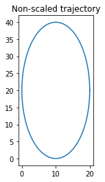
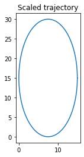

If ratios between observed and provided x and y values are too different, scale_centroids will through a warning message.
```
>>> # Scale with inverted x and y measures
>>> scaled_centroids = ivneuro.tracking.scale_centroids(centroids, 30, 15)
Warning: the observed and provided x/y ratios have a difference of above 10%, consider switching the order of X and Y dimensions or cleaning centroids data and scale again

Difference between observed and provided x/y ratios: -75.00314680815312 %
```

### Calculate speed
```
>>> # Create x and y coordinates for an oval trajectory, and timestamps with a sample rate of 5 Hz
>>> x = 10 * np.cos(np.linspace(0, 2*np.pi, 100)) + 10
>>> y = 20 * np.sin(np.linspace(0, 2*np.pi, 100)) + 20 
>>> ts = np.linspace(0,20,100).round(1)

# Calculate speed with calculate_speed function and print it
>>> speed=ivneuro.tracking.calculate_speed(x,y,ts)
>>> print(speed[:10])
[6.3431908  6.32404896 6.28590074 6.22901826 6.15381269 6.06083813 5.95079712 5.82454812 5.68311557 5.52770294]
```

### Estimate the position of an event
```
>>> # Create x and y coordinates for an oval trajectory, and timestamps with a sample rate of 5 Hz
>>> x = 10 * np.cos(np.linspace(0, 2*np.pi, 100)) + 10
>>> y = 20 * np.sin(np.linspace(0, 2*np.pi, 100)) + 20 
>>> ts = np.linspace(0,20,100).round(1)

>>> # Create an event occurring in a restricted windows of time
np.random.seed(24)
>>> event = np.random.choice(ts[(ts>10) & (ts<15)], size=5, replace = False)

>>> # Calculate the median of the positions
>>> ivneuro.tracking.position_of_event(x, y, ts, event)
(1.7632341857016716, 8.658802722744587)

>>> # Calculate the mean of the positions
>>> ivneuro.tracking.position_of_event(x, y, ts, event, estimator = np.mean)
(3.356415004157808, 7.336570446958302)

>>> # Return all the positions for x and y
>>> ivneuro.tracking.position_of_event(x, y, ts, event, estimator = None)
(array([5.        , 0.83891543, 8.57685162, 0.60307379, 1.76323419]), array([ 2.67949192, 11.98138929,  0.20357116, 13.15959713,  8.65880272]))
```

### Calculate distances to a position
```
>>> # Create x and y coordinates for an oval trajectory, and timestamps with a sample rate of 5 Hz
>>> x = 10 * np.cos(np.linspace(0, 2*np.pi, 100)) + 10
>>> y = 20 * np.sin(np.linspace(0, 2*np.pi, 100)) + 20

>>> # Position of interest
>>> center = (10, 20)

>>> # Calculate distances
>>> distances = ivneuro.tracking.distances_to_position (x, y, center)
>>> print(distances[:10])
[10.         10.06015795 10.23756293 10.523536   10.90516361 11.36703397
 11.89285055 12.46663948 13.07349149 13.69991781]
 
>>> # Plot trajectory with distances in color scale
>>> plt.scatter(x, y, c=distances, cmap = 'viridis')
>>> plt.scatter (center[0], center[1], c='black')
>>> ax = plt.gca()
>>> ax.set_aspect('equal', adjustable='box')
>>> plt.annotate('Center', xy=center)
>>> plt.show()
```
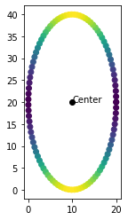


### EventPosition class
EventPosition class works as position_of_event and adds functionalties for visualization and calculating distances to the event.
```
>>> # Create x and y coordinates for an oval trajectory, and timestamps with a sample rate of 5 Hz
>>> x = 10 * np.cos(np.linspace(0, 2*np.pi, 100)) + 10
>>> y = 20 * np.sin(np.linspace(0, 2*np.pi, 100)) + 20 
>>> ts = np.linspace(0,20,100).round(1)

>>> # Create an event occurring in a restricted windows of time
np.random.seed(24)
>>> event = np.random.choice(ts[(ts>10) & (ts<15)], size=5, replace = False)

>>> # Make EventPosition object
>>> pos = ivneuro.tracking.EventPosition(x, y, ts, event)

# First 10 timestamps
>>> pos.timestamps[:10]
array([0. , 0.2, 0.4, 0.6, 0.8, 1. , 1.2, 1.4, 1.6, 1.8])

# Estimated position
>>> pos.estimated_position
(1.7632341857016716, 8.658802722744587)

# Standar deviation of the estimated position
>>> pos.position_std
(3.046678425688434, 5.0950630858715344)

>>> # Calculate distances to the estimated position of the event
>>> pos.distances_to_event()[:10]
array([21.475623  , 22.15512634, 22.84979543, 23.55469463, 24.26474295,
       24.97478946, 25.67967748, 26.3742983 , 27.05363606, 27.71280477])

# Plot trajectory, position at each occurrence of the event, and estimated position of the event
>>> pos.plot()
```
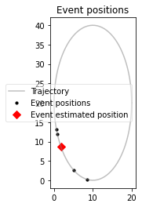

<br>

## Analysis for continuous variables

### Calculate sampling period of a timeserie

```
>>> # Create timeserie
>>> timestamps = np.arange(0, 100, 0.001)

>>> # Calculate sample period
>>> ivneuro.continuous.calculate_sampling_period(timestamps)
0.001000000000000334
```
<br>

### Calculate sampling frequency of a timeserie

```
>>> # Create timeserie
>>> timestamps = np.arange(0, 100, 0.001)

>>> # Calculate sample period
>>> ivneuro.continuous.calculate_sampling_rate(timestamps)
1000.0
```
<br>

### Peri-event histograms

**Peri-event histogram for a single variable and a single event with multiple trials, and with a pandas DataFrame as result.**
```
>>> # Create event containing the timestamps at wich the signal displays high power: burst
>>> burst = [*range(30,300, 30)]

>>> # Generate the continuous variable: a signal with pink noise and increases of power at 2Hz for 0.5 seconds at the timestamps corresponding to burst events
>>> signal = ivneuro.generate_signal(300, burst, 2, burst_duration = 0.5, burst_amplitude=1)

>>> # Calculate peri-event histogram from 5 sec before to 5 seconds after each burst event
>>> hist=ivneuro.continuous.peh(signal, burst, lower_lim = -5, higher_lim = 5, return_DataFrame = True)
>>> print(hist)
                                Signal 2Hz
Event_name Event_number Time              
Event      1            -5.000    0.308629
                        -4.999    0.383986
                        -4.998    0.337540
                        -4.997    0.301379
                        -4.996    0.396404
                                   ...
           9             4.996    1.773434
                         4.997    1.768014
                         4.998    1.742938
                         4.999    1.684667
                         5.000    1.573737

[90009 rows x 1 columns]

```
\
**Peri-event histogram for a single variable and a single event with multiple trials, and with a PeriEventHistogram object as result (default).**
```
>>> # Create event containing the timestamps at wich the signal displays high power: burst
>>> burst = [*range(30,300, 30)]

>>> # Generate the continuous variable: a signal with pink noise and increases of power at 2Hz for 0.5 seconds at the timestamps corresponding to burst events
>>> signal = ivneuro.generate_signal(300, burst, 2, burst_duration = 0.5, burst_amplitude=1)

>>> # Calculate peri-event histogram from 5 sec before to 5 seconds after each burst event
>>> hist=ivneuro.continuous.peh(signal, burst, lower_lim = -5, higher_lim = 5)
>>> print(hist)
                                Signal 2Hz
Event_name Event_number Time              
Event      1            -5.000    0.308629
                        -4.999    0.383986
                        -4.998    0.337540
                        -4.997    0.301379
                        -4.996    0.396404
                                   ...
           9             4.996    1.773434
                         4.997    1.768014
                         4.998    1.742938
                         4.999    1.684667
                         5.000    1.573737

[90009 rows x 1 columns]

>>> hist.variable_names
['Signal 2Hz']

>>> hist.event_names
['Event']

>>> hist.plot()
```
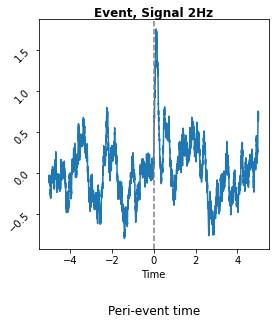

\
**Peri-event histogram for multiple variables and multiple events (with multiple trials each), and with a PeriEventHistogram object as result (default).**
```
>>> # Create events: burst contains the timestamps at wich the signals display high power; control are just control timestamps
>>> burst = [*range(30,300, 30)]
>>> control = [*range(45,300, 30)]
>>> events={'burst':burst,'control':control}

>>> # Generate the continuous variables: signals with pink noise and increases of power at specific frequencies at the timestamps corresponding to burst events
>>> signal1 = ivneuro.generate_signal(300, burst, 2, burst_duration = 0.5, burst_amplitude=1) # increases of power at 2Hz for 0.5 seconds

>>> signal2 = ivneuro.generate_signal(300, burst, 0.5, burst_duration = 2, burst_amplitude=1.5, seed = 21) # increases of power at 0.5 Hz for 2 seconds

>>> signal3 = ivneuro.generate_signal(300, burst, 0.2, burst_duration = 3, burst_amplitude=1.5, seed = 10) # increases of power at 0.2 Hz for 3 seconds

>>> signal = pd.concat([signal1, signal2, signal3], axis = 1)


>>> # Calculate peri-event histogram from 5 sec before to 5 seconds after each burst event
>>> hist=ivneuro.continuous.peh(signal, events, lower_lim = -5, higher_lim = 5)

>>> print(hist)
                                Signal 2Hz  Signal 0.5Hz  Signal 0.2Hz
Event_name Event_number Time                                          
burst      1            -5.000    0.308629      0.802330     -0.772324
                        -4.999    0.383986      0.841905     -0.842523
                        -4.998    0.337540      0.966326     -0.901157
                        -4.997    0.301379      0.992252     -0.832871
                        -4.996    0.396404      1.047770     -0.900500
                                   ...           ...           ...
control    9             4.996   -1.044383     -0.305636      0.435937
                         4.997   -0.924023     -0.291919      0.335624
                         4.998   -0.828426     -0.373948      0.254413
                         4.999   -0.929525     -0.377486      0.322428
                         5.000   -0.908036     -0.320151      0.385355

[180018 rows x 3 columns]

>>> hist.calculate_means() #Get means across trials of each event
                   Signal 2Hz  Signal 0.5Hz  Signal 0.2Hz
Event_name Time                                          
burst      -5.000   -0.025454     -0.321944     -0.269229
           -4.999   -0.028406     -0.341362     -0.272582
           -4.998   -0.048749     -0.287606     -0.287899
           -4.997   -0.043718     -0.272753     -0.285976
           -4.996   -0.063290     -0.272121     -0.260524
                      ...           ...           ...
control     4.996   -0.016638     -0.069942     -0.314620
            4.997   -0.062320     -0.056233     -0.349347
            4.998   -0.076516     -0.058079     -0.308121
            4.999   -0.122349     -0.018965     -0.296972
            5.000   -0.087980     -0.049127     -0.279140

[20002 rows x 3 columns]


>>> hist.variable_names
['Signal 2Hz', 'Signal 0.5Hz', 'Signal 0.2Hz']

>>> hist.event_names
['burst', 'control']

>>> hist.plot()
```
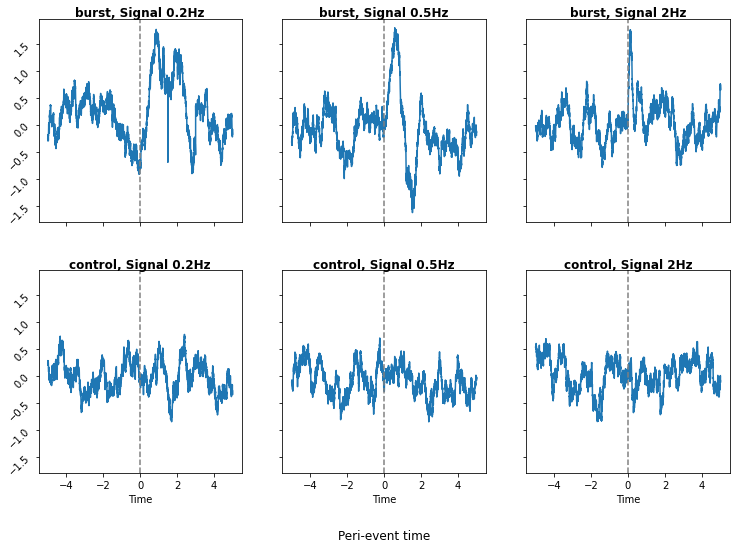

Optionally, plot() method allows for plotting a subset of variables and events
```
hist.plot(cont_names = ['Signal 0.5Hz', 'Signal 0.2Hz'], evt_names = ['burst'])
```

  
<br>

## Spectral analysis

### Peri-event spectograms

Peri-event spectograms can be calculated, normalized and visualized with the functions peri_event_spectogram, normalize_pes and plot_pes respectively.

**Peri-event spectograms for a single variable and a single event with multiple trials, and with a pandas DataFrame as result.**
```
>>> # Create event containing the timestamps at wich the signal displays high power: burst
>>> burst = [*range(30,300, 30)]

>>> # Generate the continuous variable: a signal with pink noise and increases of power at 30Hz for 2 seconds at the timestamps corresponding to burst events
>>> signal = ivneuro.generate_signal(300, burst, 30)

>>> # Calculate peri-event spectogram from 10 sec before to 10 seconds after each event
>>> pes = ivneuro.spectral.peri_event_spectogram(signal, burst, -10, 10, higher_freq=100, return_DataFrame = True)

>>> print(pes)
                                                0.0    ...     100.0
Variable_name Event_name Event_number Time             ...          
Signal 30Hz   Event      1            -10.0  0.003922  ...  0.000155
                                      -9.9   0.000142  ...  0.000178
                                      -9.8   0.020257  ...  0.000103
                                      -9.7   0.005431  ...  0.000044
                                      -9.6   0.002156  ...  0.000070
                                              ...  ...       ...
                         9             9.6   0.002953  ...  0.000106
                                       9.7   0.009216  ...  0.000046
                                       9.8   0.001603  ...  0.000077
                                       9.9   0.000025  ...  0.000022
                                       10.0  0.002685  ...  0.000042

[1809 rows x 201 columns]

>>> # Visualize peri-event spectogram
>>> ivneuro.spectral.plot_pes(pes, zero_centered = False) # If peri-event spectogram is not normalized, non-zero centered plots will be more appropiate in most cases
```
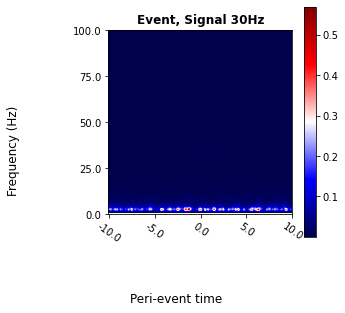

**Normalize** peri-event spectogram to the whole time range and plot
```
>>> normalized_pes = ivneuro.spectral.normalize_pes(pes) # Use the whole time range as baseline
>>> ivneuro.spectral.plot_pes(normalized_pes) # Whit normalized data, zero_centered plots (default) will be more appropiate in most cases
```
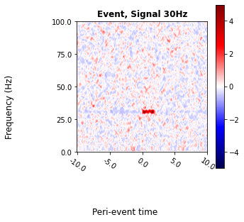

**Normalize** peri-event spectogram to a baseline and plot
```
>>> normalized_pes = ivneuro.spectral.normalize_pes(pes, baseline = (-10,-5)) # Set baseline from -10 to -5
>>> ivneuro.spectral.plot_pes(normalized_pes) # Whit normalized data, zero_centered plots (default) will be more appropiate in most cases
```
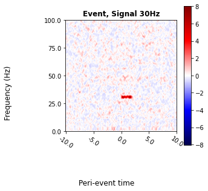

\
**Peri-event spectograms for multiple variables and multiple events (with multiple trials each), and with a pandas DataFrame as result.**
```
>>> # Create events: burst contains the timestamps at wich the signals display high power; control are just control timestamps
>>> burst = [*range(30,300, 30)]
>>> control = [*range(45,300, 30)]
>>> events={'burst':burst,'control':control}

>>> # Generate the continuous variables: signals with pink noise and increases of power at specific frequencies at the timestamps corresponding to burst events
>>> signal1 = ivneuro.generate_signal(300, burst, 30) # increases of power at 30 Hz
>>> signal2 = ivneuro.generate_signal(300, burst, 50) # increases of power at 50 Hz
>>> signal3 = ivneuro.generate_signal(300, burst, 80) # increases of power at 80 Hz

>>> signals = pd.concat([signal1, signal2, signal3], axis = 1) # Make DataFrame of signals

>>> # Calculate peri-event spectogram from 10 sec before to 10 seconds after each event
>>> pes = ivneuro.spectral.peri_event_spectogram(signals, events, -10, 10, higher_freq=100, return_DataFrame = True)

>>> print(pes)
                                                0.0    ...     100.0
Variable_name Event_name Event_number Time             ...          
Signal 30Hz   burst      1            -10.0  0.003922  ...  0.000155
                                      -9.9   0.000142  ...  0.000178
                                      -9.8   0.020257  ...  0.000103
                                      -9.7   0.005431  ...  0.000044
                                      -9.6   0.002156  ...  0.000070
                                              ...  ...       ...
Signal 80Hz   control    9             9.6   0.002318  ...  0.000048
                                       9.7   0.000970  ...  0.000086
                                       9.8   0.000638  ...  0.000145
                                       9.9   0.000625  ...  0.000083
                                       10.0  0.000440  ...  0.000020

[10854 rows x 201 columns]


>>> normalized_pes = ivneuro.spectral.normalize_pes(pes, baseline = (-10,-5), method = "Condition_specific") # Set baseline from -10 to -5 and use "Condition_specific" method

>>> ivneuro.spectral.plot_pes(normalized_pes) # Whit normalized data, zero_centered plots (default) will be more appropiate in most cases
```
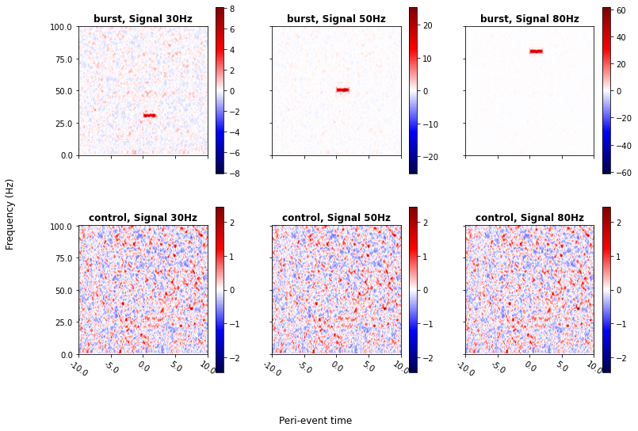

\
**Peri-event spectogram for multiple variables and multiple events (with multiple trials each), and with a PeriEventSpectogram object as result (default).**

Peri-event spectograms analysis can be higly demanding, depending on the size and amount of continuous variables, the frequencies analysed, the amount of reference events and number of trials of each of event. PeriEventSpectogram class aims to facilitate processing, interpretation and visualization of peri-event spectograms without running the analysis again, and is returned by default by peri_event_spectogram function.

```
>>> # Create events: burst contains the timestamps at wich the signals display high power; control are just control timestamps
>>> burst = [*range(30,300, 30)]
>>> control = [*range(45,300, 30)]
>>> events={'burst':burst,'control':control}

>>> # Generate the continuous variables: signals with pink noise and increases of power at specific frequencies at the timestamps corresponding to burst events
>>> signal1 = ivneuro.generate_signal(300, burst, 30, burst_amplitude=0.06) # slight increase of power at 30 Hz
>>> signal2 = ivneuro.generate_signal(300, burst, 32, burst_amplitude=0.13) # large increase of power at 32 Hz
>>> signal3 = ivneuro.generate_signal(300, burst, 80, burst_amplitude=0.05) # large increase of power at 80 Hz

>>> signals = pd.concat([signal1, signal2, signal3], axis = 1) # Make DataFrame of signals

>>> # Calculate peri-event spectogram from 10 sec before to 10 seconds after each event
>>> pes = ivneuro.spectral.peri_event_spectogram(signals, events, -10, 10, higher_freq=100)
>>> # Print DataFrame (the DataFrame returned if return_DataFrame is True)
>>> pes.data
                                                0.0    ...     100.0
Variable_name Event_name Event_number Time             ...          
Signal 30Hz   burst      1            -10.0  0.003922  ...  0.000155
                                      -9.9   0.000142  ...  0.000178
                                      -9.8   0.020257  ...  0.000103
                                      -9.7   0.005431  ...  0.000044
                                      -9.6   0.002156  ...  0.000070
                                              ...  ...       ...
Signal 80Hz   control    9             9.6   0.002318  ...  0.000048
                                       9.7   0.000970  ...  0.000086
                                       9.8   0.000638  ...  0.000145
                                       9.9   0.000625  ...  0.000083
                                       10.0  0.000440  ...  0.000020

[10854 rows x 201 columns]

>>> # Print the names of the original continuous variables
>>> pes.variable_names
['Signal 30Hz', 'Signal 32Hz', 'Signal 80Hz']

>>> # Print event names
>>> pes.event_names
['burst', 'control']

>>> # Slice and print timestamps
>>> pes.timestamps[0], pes.timestamps[-1] # Print min and max timestamps
(-10.0, 10.0)
>>> sliced_pes = pes.slice_time((-5,5)) # Slice timestamps
>>> sliced_pes.timestamps[0], sliced_pes.timestamps[-1] # Print min and max timestamps
(-5.0, 5.0)

>>> # Visualize peri-event spectogram
>>> pes.plot() # Unless it is especified, this method set zero_centered automatically to False if data is not normalized and to True if data is normalized
```
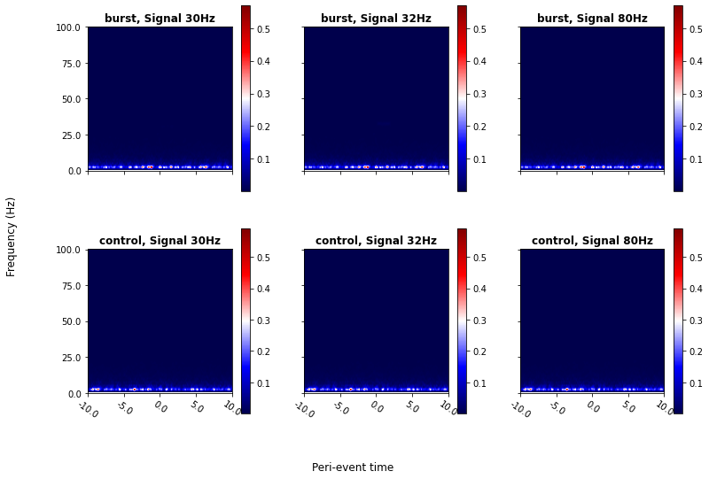

Normalize peri-event spectogram and plot again
```
>>> # Normalize
>>> normalized_pes = pes.normalize()

>>> # Visualize peri-event spectogram
>>> normalized_pes.plot() # Unless it is especified, this method set zero_centered automatically to False if data is not normalized and to True if data is normalized
```
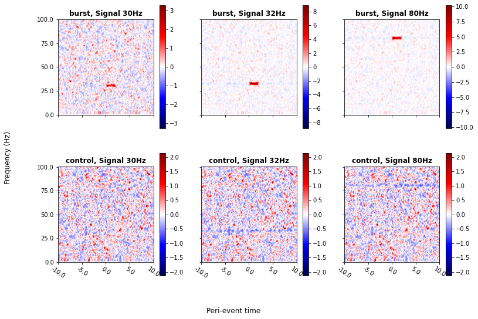

\
**Peri-event spectogram using the sample_subsample argument such as signal1 and signal2 are replicates of the same sample (sample1), and signal3 correspond to a different sample (sample2).**
```
>>> # Create events: burst contains the timestamps at wich the signals display high power; control are just control timestamps
>>> burst = [*range(30,300, 30)]
>>> control = [*range(45,300, 30)]
>>> events={'burst':burst,'control':control}

>>> # Generate the continuous variables: signals with pink noise and increases of power at specific frequencies at the timestamps corresponding to burst events
>>> signal1 = ivneuro.generate_signal(300, burst, 30, burst_amplitude=0.06) # slight increase of power at 30 Hz
>>> signal2 = ivneuro.generate_signal(300, burst, 32, burst_amplitude=0.13) # large increase of power at 32 Hz
>>> signal3 = ivneuro.generate_signal(300, burst, 80, burst_amplitude=0.05) # large increase of power at 80 Hz

>>> signals = pd.concat([signal1, signal2, signal3], axis = 1) # Make DataFrame of signals

>>> # Make dictionary to group replicates of each sample
>>> sample_subsamples = {'sample1' : ['Signal 30Hz', 'Signal 32Hz'], 'sample2':['Signal 80Hz']}

>>> # Calculate peri-event spectogram from 10 sec before to 10 seconds after each event
>>> pes = ivneuro.spectral.peri_event_spectogram(signals, events, -10, 10, higher_freq=100, sample_subsamples = sample_subsamples)

>>> # Print variables
>>> pes.variable_names
['sample1', 'sample2']

>>> # Normalize
>>> pes.normalize(baseline = (-10,-5), method = 'Trial_specific', inplace = True) # Specify baseline, method and inplace to modify the current object

>>> # Plot only burst event of the peri-event spectogram
>>> pes.plot(evt_names = ['burst']) # Plot method allows to select events and variables to plot from the peri-event spectogram object
```
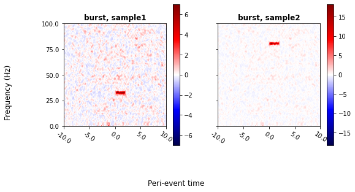


### Delta power spectral

delta_power_spectral function calculates the difference in power at each frequency of the spectrum between a time interval of interest and a baseline interval.

**Delta power spectral analysis for a single variable**
```
>>> # Create event containing the timestamps at wich the signal displays high power: burst
>>> burst = [*range(30,300, 30)]

>>> # Generate the continuous variable: a signal with pink noise and increases of power at 30Hz for 2 seconds at the timestamps corresponding to burst events
>>> signal = ivneuro.generate_signal(300, burst, 30)

>>> # Make slices for burst intervals, from the onset to the offset of the power increase
>>> burst_intervals = ivneuro.events.make_intervals(burst, 0, 2)
>>> # Make slices for baseline intervals, from the -6 to -4 seconds from the onset of the power increase
>>> baseline_intervals = ivneuro.events.make_intervals(burst, -6, -4)


>>> # Calculate power spectral at each interva (burst and baseline) and delta power spectral
>>> power_burst, power_baseline, delta_power = ivneuro.spectral.delta_power_spectral(signal, burst_intervals, baseline_intervals, lowest_freq = 0, highest_freq = 100)

>>> print(delta_power.head())
     Signal 30Hz
0.0     0.214549
0.5     0.012835
1.0     0.249725
1.5     0.052506
2.0     0.016412

>>> # Visualize data
>>> power_burst.plot()
>>> power_baseline.plot()
>>> delta_power.plot()
```
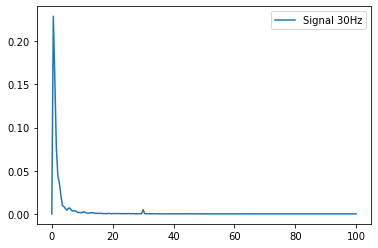
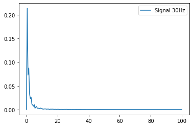
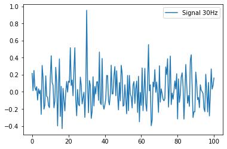

\
**Delta power spectral analysis for multiple variables**
```
>>> # Create event containing the timestamps at wich the signal displays high power: burst
>>> burst = [*range(30,300, 30)]

>>> # Generate the continuous variables: signals with pink noise and increases of power at specific frequencies at the timestamps corresponding to burst events
>>> signal1 = ivneuro.generate_signal(300, burst, 30, burst_amplitude=0.06, seed=15) # slight increase of power at 30 Hz
>>> signal2 = ivneuro.generate_signal(300, burst, 30.5, burst_amplitude=0.13, seed = 30) # large increase of power at 30.5 Hz
>>> signal3 = ivneuro.generate_signal(300, burst, 80, burst_amplitude=0.05, seed = 50) # large increase of power at 80 Hz

>>> signals = pd.concat([signal1, signal2, signal3], axis = 1) # Make DataFrame of signals

>>> # Make slices for burst intervals, from the onset to the offset of the power increase
>>> burst_intervals = ivneuro.events.make_intervals(burst, 0, 2)
>>> # Make slices for baseline intervals, from the -6 to -4 seconds from the onset of the power increase
>>> baseline_intervals = ivneuro.events.make_intervals(burst, -6, -4)


>>> # Calculate power spectral at each interval (burst and baseline) and delta power spectral
>>> power_burst, power_baseline, delta_power = ivneuro.spectral.delta_power_spectral(signals, burst_intervals, baseline_intervals, lowest_freq = 0, highest_freq = 100)

>>> print(delta_power.head())
     Signal 30Hz  Signal 30.5Hz  Signal 80Hz
0.0    -0.110932       0.099728    -0.006010
0.5    -0.087769       0.009631     0.149461
1.0     0.180706       0.042847     0.142876
1.5    -0.167544      -0.216875     0.257452
2.0     0.108177      -0.360670     0.086913

>>> # Visualize data
>>> delta_power.plot()
```
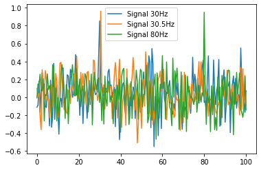

\
**Delta power spectral analysis for multiple variables using the sample_subsample argument such as signal1 and signal2 are replicates of the same sample (sample1), and signal3 correspond to a different sample (sample2).**
```
>>> # Create event containing the timestamps at wich the signal displays high power: burst
>>> burst = [*range(30,300, 30)]

>>> # Generate the continuous variables: signals with pink noise and increases of power at specific frequencies at the timestamps corresponding to burst events
>>> signal1 = ivneuro.generate_signal(300, burst, 30, burst_amplitude=0.06, seed=15) # slight increase of power at 30 Hz
>>> signal2 = ivneuro.generate_signal(300, burst, 30.5, burst_amplitude=0.13, seed = 30) # large increase of power at 30.5 Hz
>>> signal3 = ivneuro.generate_signal(300, burst, 80, burst_amplitude=0.05, seed = 50) # large increase of power at 80 Hz

>>> signals = pd.concat([signal1, signal2, signal3], axis = 1) # Make DataFrame of signals

>>> # Make slices for burst intervals, from the onset to the offset of the power increase
>>> burst_intervals = ivneuro.events.make_intervals(burst, 0, 2)
>>> # Make slices for baseline intervals, from the -6 to -4 seconds from the onset of the power increase
>>> baseline_intervals = ivneuro.events.make_intervals(burst, -6, -4)

>>> # Make dictionary to group replicates of each sample
>>> sample_subsamples = {'sample1' : ['Signal 30Hz', 'Signal 30.5Hz'], 'sample2':['Signal 80Hz']}

>>> # Calculate power spectral at each interval (burst and baseline) and delta power spectral
>>> power_burst, power_baseline, delta_power = ivneuro.spectral.delta_power_spectral(signals, burst_intervals, baseline_intervals, lowest_freq = 0, highest_freq = 100, sample_subsamples = sample_subsamples)

>>> print(delta_power.head())
      sample1   sample2
0.0 -0.005602 -0.006010
0.5 -0.039069  0.149461
1.0  0.111776  0.142876
1.5 -0.192209  0.257452
2.0 -0.126247  0.086913

>>> # Visualize data
>>> delta_power.plot()
```
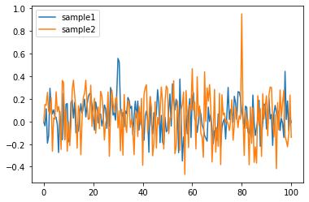


### Delta coherence

delta_coherence function calculates the difference in coherence at each frequency of the spectrum between a time interval of interest and a baseline interval.

\
**Delta coherence analysis for multiple variables**
```
>>> # Create event containing the timestamps at wich the signal displays high power: burst
>>> burst = [*range(30,300, 30)]

>>> # Generate the continuous variables: signals with pink noise and increases of power at specific frequencies at the timestamps corresponding to burst events
>>> signal1 = ivneuro.generate_signal(300, burst, 30, burst_amplitude=0.06, seed=15) # slight increase of power at 30 Hz
>>> signal2 = ivneuro.generate_signal(300, burst, 30.2, burst_amplitude=0.13, seed = 30) # large increase of power at 30.2 Hz
>>> signal3 = ivneuro.generate_signal(300, burst, 80, burst_amplitude=0.05, seed = 50) # large increase of power at 80 Hz

>>> signals = pd.concat([signal1, signal2, signal3], axis = 1) # Make DataFrame of signals

>>> # Make slices for burst intervals, from the onset to the offset of the power increase
>>> burst_intervals = ivneuro.events.make_intervals(burst, 0, 2)
>>> # Make slices for baseline intervals, from the -6 to -4 seconds from the onset of the power increase
>>> baseline_intervals = ivneuro.events.make_intervals(burst, -6, -4)


>>> # Calculate coherence at each interval (burst and baseline) and delta coherence
>>> coherence_burst, coherence_baseline, delta_coherence = ivneuro.spectral.delta_coherence(signals, burst_intervals, baseline_intervals, lowest_freq = 0, highest_freq = 150)

>>> print(delta_coherence.head())
      Signal 30Hz             Signal 30.2Hz
    Signal 30.2Hz Signal 80Hz   Signal 80Hz
0.0     -0.079927   -0.024874      0.068144
0.5     -0.045909   -0.058171      0.043984
1.0     -0.019668   -0.081587      0.025753
1.5     -0.015086   -0.076264      0.023711
2.0     -0.016446   -0.059058      0.025952

>>> # Visualize data
>>> delta_coherence.plot()
```
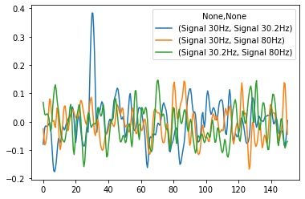

**Delta coherence analysis for multiple variables using the sample_subsample argument such as signal1 and signal2 are replicates of the same sample (sample1), and signal3 correspond to a different sample (sample2)**
```
>>> # Create event containing the timestamps at wich the signal displays high power: burst
>>> burst = [*range(30,300, 30)]

>>> # Generate the continuous variables: signals with pink noise and increases of power at specific frequencies at the timestamps corresponding to burst events
>>> signal1 = ivneuro.generate_signal(300, burst, 30, burst_amplitude=0.06, seed=15) # slight increase of power at 30 Hz
>>> signal2 = ivneuro.generate_signal(300, burst, 30.2, burst_amplitude=0.13, seed = 30) # large increase of power at 30.2 Hz
>>> signal3 = ivneuro.generate_signal(300, burst, 80, burst_amplitude=0.05, seed = 50) # large increase of power at 80 Hz

>>> signals = pd.concat([signal1, signal2, signal3], axis = 1) # Make DataFrame of signals

>>> # Make slices for burst intervals, from the onset to the offset of the power increase
>>> burst_intervals = ivneuro.events.make_intervals(burst, 0, 2)
>>> # Make slices for baseline intervals, from the -6 to -4 seconds from the onset of the power increase
>>> baseline_intervals = ivneuro.events.make_intervals(burst, -6, -4)

>>> # Make dictionary to group replicates of each sample
>>> sample_subsamples = {'sample1' : ['Signal 30Hz', 'Signal 30.2Hz'], 'sample2':['Signal 80Hz']}

>>> # Calculate coherence at each interval (burst and baseline) and delta coherence
>>> coherence_burst, coherence_baseline, delta_coherence = ivneuro.spectral.delta_coherence(signals, burst_intervals, baseline_intervals, lowest_freq = 0, highest_freq = 150, sample_subsamples = sample_subsamples)

>>> print(delta_coherence.head())
      sample1          
      sample1   sample2
0.0 -0.079927  0.021635
0.5 -0.045909 -0.007093
1.0 -0.019668 -0.027917
1.5 -0.015086 -0.026276
2.0 -0.016446 -0.016553

>>> # Visualize data
>>> delta_coherence.plot()
```
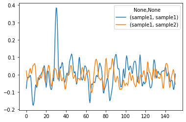

Note: sample1 to sample1 coherence is calculated here as coherence between replicates of sample1. Sample2 to sample2 coherence is not calculated because it only has one replicate.


